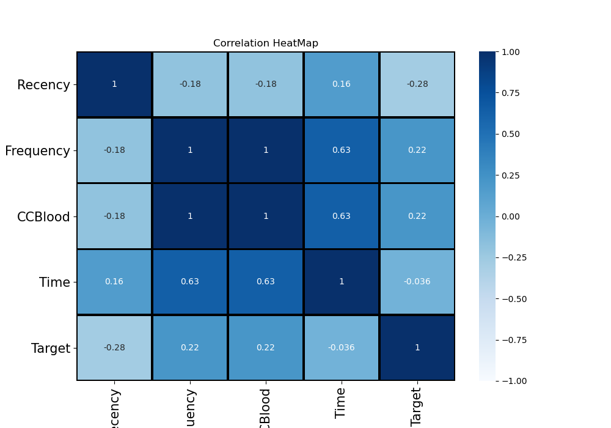
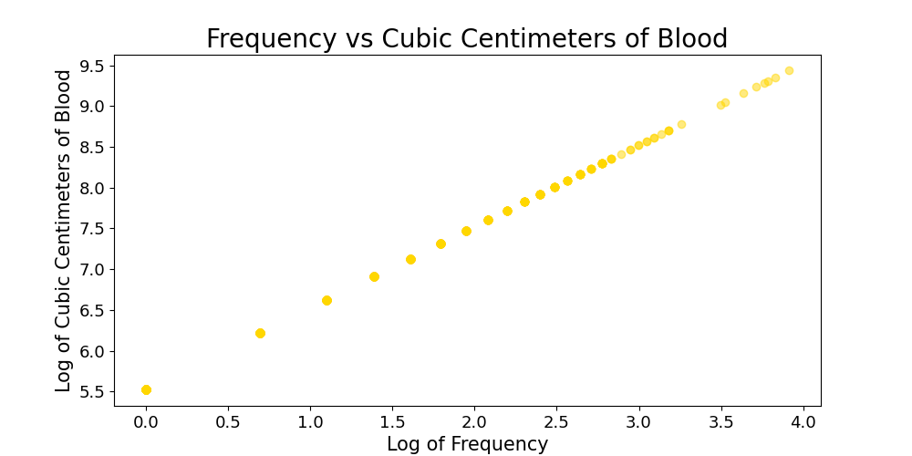
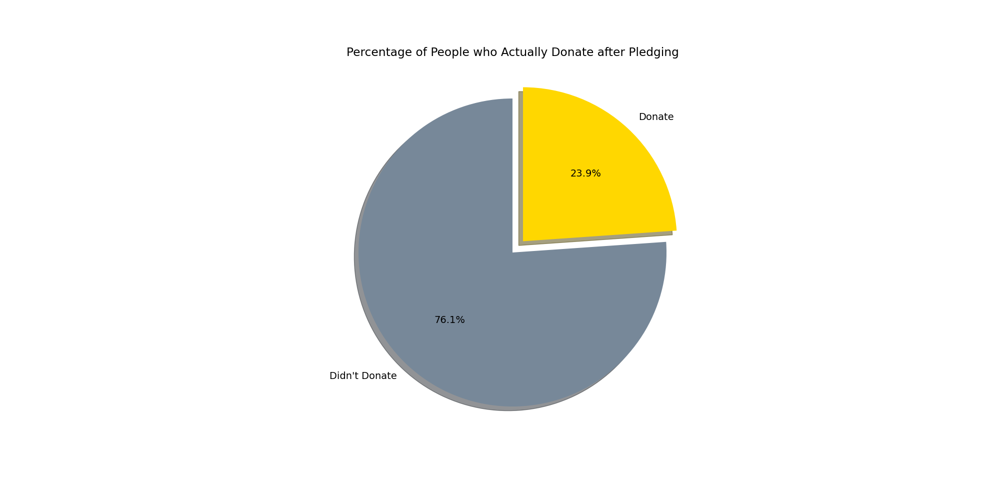
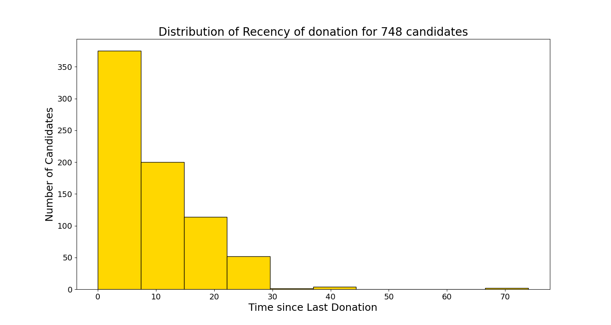
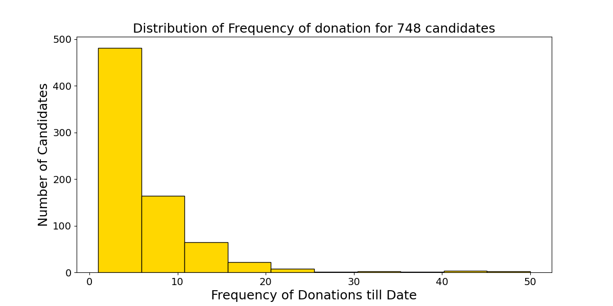
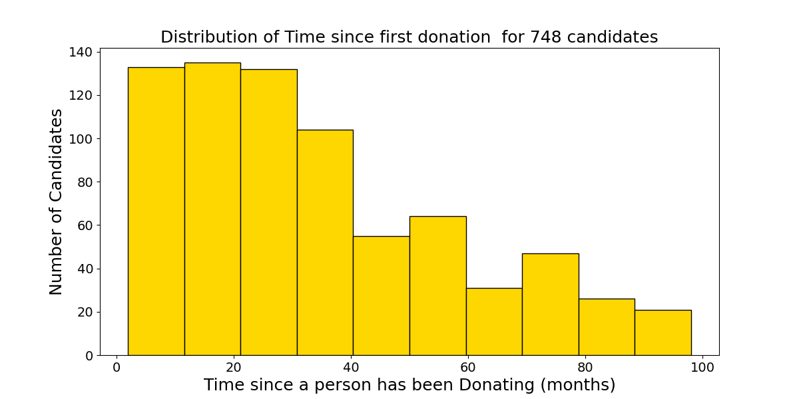
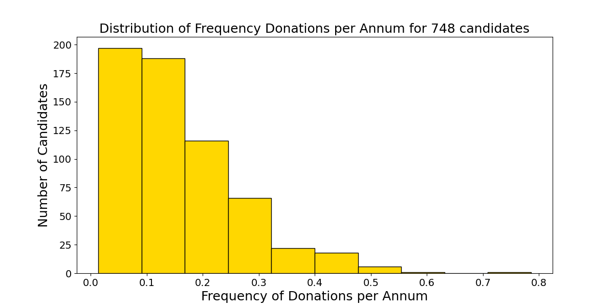
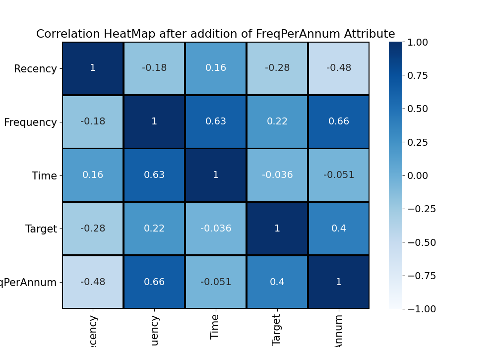

# PyVisualizer

This project has been carried out in collaboration with Nihar Salunke - Final Year CSE at University of Pune and under the Bangalore-based startups Edify Accelerators and Bloom India.

Nihar Salunke created PyVisulaizer in June 2020 so that data scientists can easily render their analysis results to a dashboard format.

We make use of various Classification models to predict a person's Willingness to Donate Blood.

Project Team Members:

<li>Neelima Saini - Program Manager at Intellify | Final Year MBA in Data Science at Institiute of Product Leadership, Bangalore</li>
<li>Nikhil Kulkarni - Data Scientist and Web Developer | Junior Year BCE at Marathwada Mitra Mandal's College of Engineering, Pune</li>
<li>Pratiksha Sharma - Research Intern at University of Masachussetts Boston | Final Year Bachelor of Data Science at S P Jain School of Global Management, Sydney</li>

<h1>Output:</h1>
<h1>Co-relation Heatmap</h1>

  
  

<h1>Frequency v/s Volume</h1>

  

<h1>Pie chart of people who pledge</h1>

  
  

  <h1>Distribution Of Recency</h1>

  

  

<h1>Distribution of Frequency</h1>

  
  

<h1>  Distribution of Time since first donation</h1>
  

  

<h1>Distribution of Donation per Annum</h1><h1>
  

  

<h1>Updated Heatmap</h1>

  
  

 
